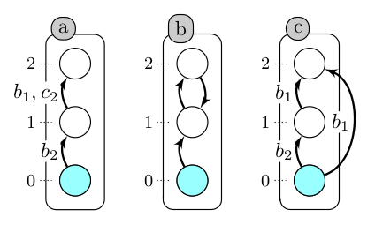

# AAN-reach

AAN-reach is a reachability solver the Asynchronous Automata Network framework. This program encodes the dynamics of Asynchronous Automata Networks into a SAT instance. Then, an external SAT solver is used to look for an execution sequence that verify the reachabillity. In some cases, it is also able to prove the unreachability by computing a sufficient bound on the length of execution sequences. This bound is derived from static analysis tools. For the inconclusive cases, a manual bound can be set to check reachability in bounded sequences.

## How to use it ?

### Operating system

This program has been successfully tested on Ubuntu 18.04.2 LTS.

### Dependencies

The program can use two SAT solvers:

- [minisat](http://minisat.se/MiniSat.html)
- [glucose](http://www.labri.fr/perso/lsimon/glucose/)

These solvers are installed automatically with the installing script. However, you may need the packages **curl** and **zlib1g-dev** (can be installed with the command: sudo apt install "package")

### Installation

First, make the install script executable: sudo chmod +x install.sh. Then, use the command: ./install.sh to download the SAT solvers and compile the program.

### List of parameters

- -s: SAT solver used, minisat or glucose
- -m: Automata Network model path (.an file)
- -i: initial state, for example "a=0,b=0,c=0"
- -g: reachability goal, for example "a=3"
- -b: set a manual bound for the Bounded Model Checking
- -d: debug level, between 0 and 2
- -k_induction: apply k-induction technique to look for a bound, -b has to be specified
- -h: show the help

### Examples

The two following instances are reachable:

- ./aan_reach -s minisat -m "models/example_1.an" -i "a=0,b=0,c=0,d=0" -g "a=3"
- ./aan_reach -s minisat -m "models/example_3.an" -i "a=0,b=0,c=0" -g "a=1"

The following example is not reachable (provable with the bound):

- ./aan_reach -s glucose -m "models/example_3.an" -i "a=0,b=0,c=0" -g "a=2"

The next example is reachable (n states) but the local causality bound cannot be computed:

- ./aan_reach -s minisat -m "models/example_2.an" -i "a=0,b=0,c=0,d=0,e=0" -g "a=1"

A bound can be set manually to compute a reachable sequence:

- ./aan_reach -s minisat -m "models/example_2.an" -i "a=0,b=0,c=0,d=0,e=0" -g "a=1" -b 8

The k-induction technique can also be used to compute a bound to make unreachability proofs (see below). You can use the option "-k_induction" to check if a length can be used as a completeness bound. The bound option "-b" has to be used at the same time.

The first example is a random Automata Network with 10 automata. The next two lines show two length, the second one is enough to be used as a bound, proved by the k-induction technique.

- ./aan_reach -s glucose -m "models/random_10.an" -i "0=0, 1=0, 2=1, 3=1, 4=0, 5=1, 6=0, 7=1, 8=0, 9=0" -g "1=1" -b 8 -k_induction
- ./aan_reach -s glucose -m "models/random_10.an" -i "0=0, 1=0, 2=1, 3=1, 4=0, 5=1, 6=0, 7=1, 8=0, 9=0" -g "1=1" -b 10 -k_induction

We can see here that the reachability is possible and the local causality bound can be computed:

./aan_reach -s glucose -m "models/random_10.an" -i "0=0, 1=0, 2=1, 3=1, 4=0, 5=1, 6=0, 7=1, 8=0, 9=0" -g "1=1"

The next instance is not reachable, once again, the local causality bound can be computed. In this example, the k-induction gives:

./aan_reach -s glucose -m "models/random_10.an" -i "0=1, 1=0, 2=0, 3=1, 4=0, 5=0, 6=0, 7=1, 8=0, 9=1" -g "8=1" -b 12 -k_induction

### Documentation

A documentation of the source code can be generated thanks to [Doxygen](http://doxygen.nl/). To generate the documentation, Doxygen must be installed. Then, use the command: doxygen Doxyfile

The documentation is generated in html, in the doc directory. It con be visualized by opening the file index.html in a web browser.  

## Asynchronous Automata Network

Asynchronous Automata Networks is a modeling framework used to represent dynamic systems, such as biological regulatory networks. These models are composed by several automata. Each automaton has several local states and transitions between these local states. The set of (global) states of the model is the cross product of all the local states of the automata. Transitions are also labeled by some local states. A transition can be played from a (global state) if the local states of the transition are present in this state. The Asynchronicity means that from one global state, only one transition can be played. A description of the format can be found [here](https://loicpauleve.name/pint/doc/automata-networks.html).

The Automata Network above contains 3 automata with 3 local states for each. (a_1,b_1,c_2) is a global state from which the transition a_1 -> a_2 (b_1, c_2) can be played. The resulting state after playing the transition is (a_2,b_1,c_2).

## Reachability problem

In this framework, the reachability problem is the following question : given an initial global state, is there an execution sequence that leads to a global state with a specific local state ?

For example, in the previous example, the reachability of a_2 from (a_0,b_0,c_0) is possible. Indeed, this local state can be reached after successively playing the transitions : b_0 -> b_1 ; c_0 -> c_2 ; b_1 -> b_2 ; a_0 -> a_1 ; b_2 -> b_1 ; a_1 -> a_2

## Solving reachability through Bounded Model Checking and static analysis

To solve reachability, the program encodes the dynamics of Asynchronous Automata Networks into a propositional logic formula, which is then solved by a SAT solver. The encoding represent an execution sequence of the model. Thus, it is necessary to set the length of the bound.

If the reachability can be done with the chosen length, the SAT solver returns a corresponding reachability sequence. If not, this gives an unreachability proof only for the chosen length. To prove unreachability in the general case, it is necessary to prove that the rechability is not possible even with longer sequences.

The approach used in this program comes from the static analysis tools employed in the solver [Pint](https://loicpauleve.name/pint/). A graph is build to compute a reachability bound. Unfortunately, this bound cannot be computed for every reachability instance.

## Bounded Model Checking completeness bounds

Other bounds for complete Bounded Model Checking, more especially for Bounded Model Checking, can be derived directly from satisfiability solving. For example, the k-induction technique can be used for such a bound. The idea is to compute the longest shortest path from any state to the goal state. If the solver returns UNSAT, it means that the initial reachability problem cannot be solved either (there is no longer path from any state to the goal state)

Several examples to compare k-induction with local causality bound (when it is possible) are provided:

Random Automata Network of size 10:
  - Initial state: 0=1, 1=0, 2=0, 3=1, 4=0, 5=0, 6=0, 7=1, 8=0, 9=1
  - Goal state: 8=1
  - Reachability: No
  - Local causality bound: 6
  - k-Induction bound: 12

  - Initial state: 0=0, 1=0, 2=1, 3=1, 4=0, 5=1, 6=0, 7=1, 8=0, 9=0
  - Goal state: 1=1
  - Reachability: Yes
  - Local causality bound: 3
  - k-Induction bound: 10

Random Automata Network of size 15:
  - Initial state: 0=0, 1=0, 2=1, 3=1, 4=0, 5=1, 6=0, 7=0, 8=0, 9=1, 10=1, 11=1, 12=0, 13=0, 14=1
  - Goal state: 14=0
  - Reachability: No
  - Local causality bound: 6
  - k-Induction bound: 16

  - Initial state: 0=1, 1=1, 2=0, 3=0, 4=1, 5=0, 6=0, 7=0, 8=0, 9=1, 10=1, 11=0, 12=1, 13=1, 14=1
  - Goal state: 14=0
  - Reachability: Yes
  - Local causality bound: 7
  - k-Induction bound: 21

Random Automata Network of size 20:

  - Initial state: 0=0, 1=0, 2=1, 3=1, 4=0, 5=1, 6=0, 7=1, 8=0, 9=0, 10=0, 11=1, 12=1, 13=1, 14=1, 15=0, 16=0, 17=0, 18=0, 19=0
  - Goal state: 4=1
  - Reachability: No
  - Local causality bound: 14
  - k-Induction bound: 32

  - Initial state:  0=0, 1=1, 2=1, 3=1, 4=1, 5=1, 6=0, 7=0, 8=0, 9=0, 10=0, 11=0, 12=1, 13=1, 14=1, 15=0, 16=0, 17=0, 18=0, 19=0
  goal: 10=0
  - Goal state: 11=1
  - Reachability: Yes
  - Local causality bound: 15
  - k-Induction bound: 48

  - Initial state:  0=1, 1=0, 2=1, 3=0, 4=0, 5=0, 6=0, 7=0, 8=0, 9=1, 10=1, 11=0, 12=1, 13=0, 14=1, 15=1, 16=1, 17=0, 18=0, 19=1
  goal: 10=0
  - Goal state: 10=0
  - Reachability: Yes
  - Local causality bound: 12
  - k-Induction bound: 32
